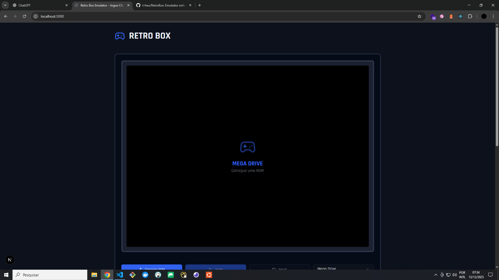

# 🎮 RetroBox Emulator

RetroBox é um **emulador online multi-sistema** para consoles clássicos, permitindo jogar ROMs retrô diretamente no navegador, sem instalação.

Suporta múltiplos sistemas como **Mega Drive (Sega Genesis), NES, SNES, Game Boy, PlayStation** e outros.

---

## 🕹️ Funcionalidades

- 🎮 Emulação de múltiplos consoles clássicos
- 📂 Carregamento de ROMs locais
- ▶️ Controles de Play / Pause / Reset
- 🖥️ Interface moderna e responsiva
- 🌙 Suporte a tema claro / escuro
- 🌐 Execução 100% no navegador

---

## 📸 Screenshots

### Interface principal



### ROM carregada e pronta para jogar


### Game carregado


---

## 📦 Sistemas Suportados

- Mega Drive / Sega Genesis
- Master System
- NES
- SNES
- Game Boy
- PlayStation  
*(novos sistemas podem ser adicionados facilmente)*

---

## ⌨️ Controles Básicos

- **Setas** → Direcionais
- **Z / X** → Botões A / B
- **Enter** → Start
- **Shift** → Select  
*(pode variar conforme o sistema emulado)*

---

## 🚀 Tecnologias Utilizadas

- **Next.js**
- **React**
- **TypeScript**
- **Tailwind CSS**
- **Radix UI**
- **Lucide Icons**
- **EmulatorJS**

---

## ⚠️ Aviso Legal

Este projeto **não fornece ROMs**.

Use apenas:
- ROMs de jogos que você possui legalmente
- Jogos **homebrew** ou de domínio público

ROMs comerciais são protegidas por direitos autorais.

---

## 🛠️ Rodando localmente

```bash
npm install
npm run dev
